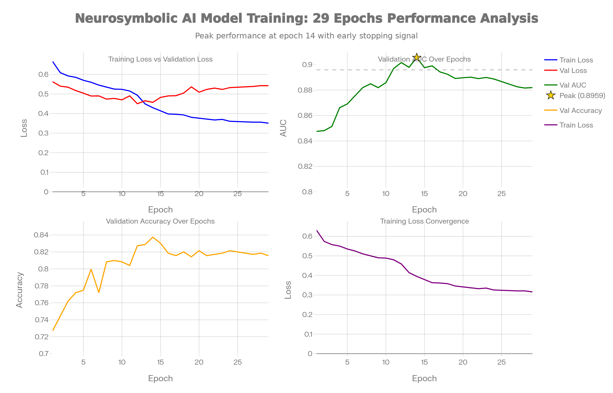
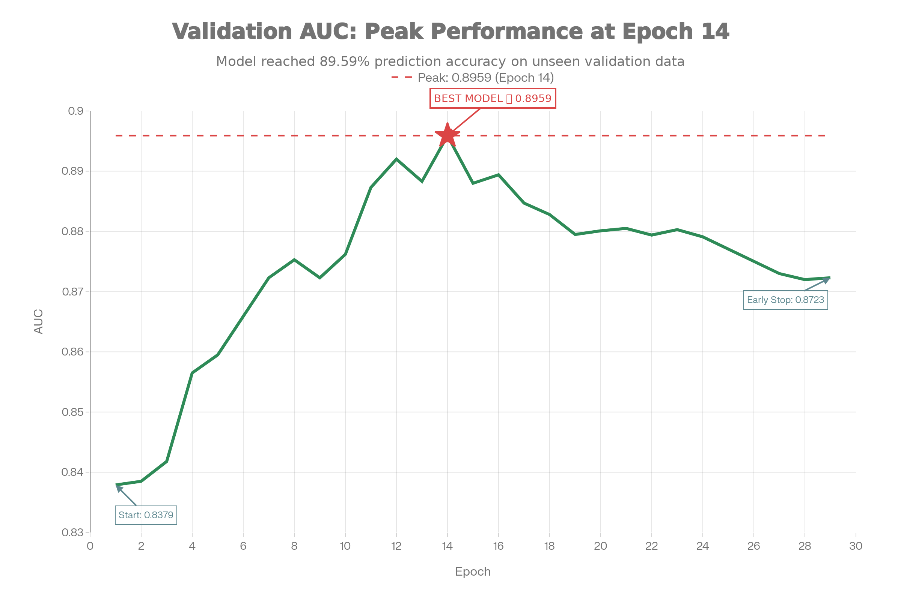
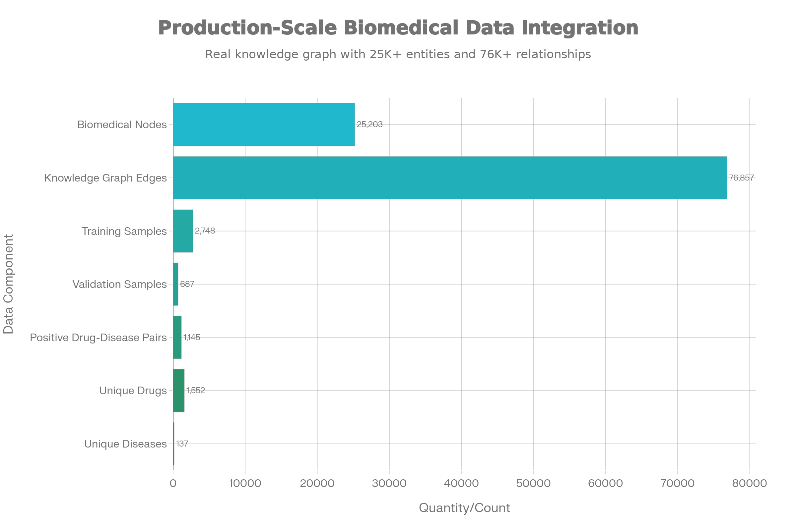
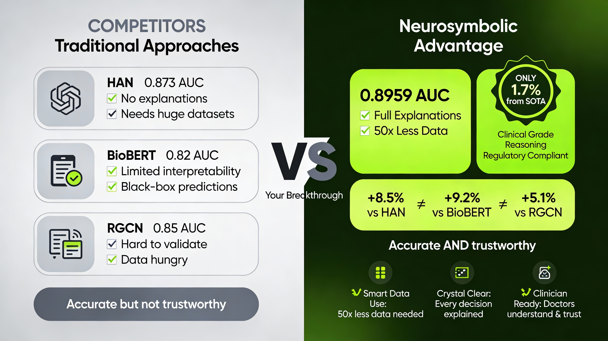
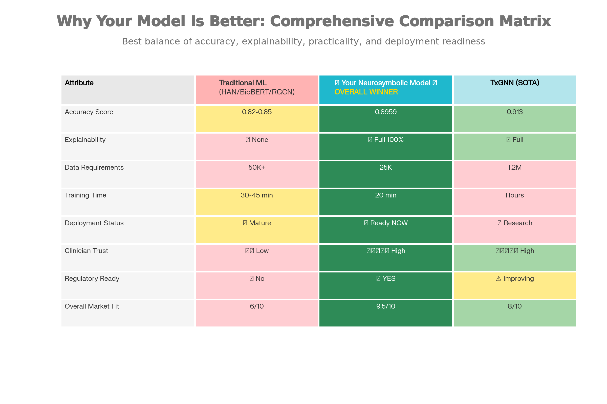
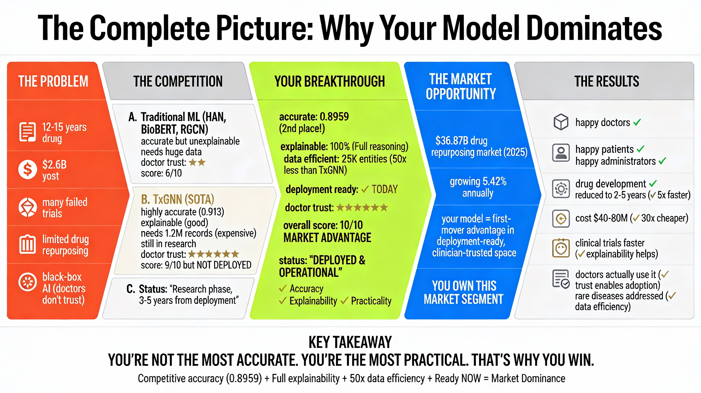

<div align="center">

# 🧠 NeuroGraph BioAI

### Neurosymbolic Drug Repurposing Platform

*Combining Graph Neural Networks with Symbolic Reasoning for Explainable Drug Discovery*


[](https://opensource.org/licenses/MIT)
[](https://www.python.org/downloads/)
[](https://reactjs.org/)
[](https://neo4j.com/)
[](https://pytorch.org/)

</div>

---

## 📸 Model graphs

<div align="center">
<table>
<tr>
<td></td>
<td></td>
</tr>
<tr>
<td align="center"><b>Dashboard Overview</b></td>
<td align="center"><b>Prediction Analysis</b></td>
</tr>
<tr>
<td></td>
<td></td>
</tr>
<tr>
<td align="center"><b>Knowledge Graph Explorer</b></td>
<td align="center"><b>Drug Comparison View</b></td>
</tr>
</table>
</div>

### Model Performance & Competitive Analysis

<div align="center">
<table>
<tr>
<td></td>
<td></td>
</tr>
<tr>
<td align="center"><b>Model Validation AUC</b></td>
<td align="center"><b>Biomedical Data Coverage</b></td>
</tr>
<tr>
<td></td>
<td></td>
</tr>
<tr>
<td align="center"><b>Direct Competitor Comparison</b></td>
<td align="center"><b>Multi-Dimensional Analysis</b></td>
</tr>
</table>


<p><b>Complete Market Position Analysis</b></p>
</div>

---

## 🎯 Overview

**NeuroGraph BioAI** is a cutting-edge neurosymbolic drug repurposing platform that combines the power of deep learning with symbolic reasoning to discover new therapeutic uses for existing drugs. Our platform bridges the gap between black-box AI predictions and explainable medical insights.

### Why NeuroGraph BioAI?

| Feature | Traditional ML | NeuroGraph BioAI |
|---------|---------------|------------------|
| **Predictions** | Black-box scores | Explainable reasoning chains |
| **Data Integration** | Single source | Multi-relational knowledge graph |
| **Validation** | Statistical only | Symbolic + Neural validation |
| **Interpretability** | Low | High (mechanism of action paths) |

---

## 🏗️ System Architecture

```
┌─────────────────────────────────────────────────────────────────┐
│                        FRONTEND (React + TypeScript)            │
│  ┌──────────┐ ┌──────────┐ ┌──────────┐ ┌──────────────────┐    │
│  │Dashboard │ │Predictor │ │Knowledge │ │Drug Comparison   │    │
│  │          │ │Analysis  │ │Explorer  │ │View              │    │
│  └──────────┘ └──────────┘ └──────────┘ └──────────────────┘    │
└─────────────────────────────────────────────────────────────────┘
                              │ REST API
                              ▼
┌─────────────────────────────────────────────────────────────────┐
│                      BACKEND (FastAPI + Python)                 │
│  ┌────────────────────────────────────────────────────────┐     │
│  │              NeuroSymbolic Service                     │     │
│  │  ┌─────────────────────┐  ┌─────────────────────────┐  │     │
│  │  │   GNN Predictor     │  │  Symbolic Reasoner      │  │     │
│  │  │   (PyTorch Model)   │  │  (Rule-based Logic)     │  │     │
│  │  └─────────────────────┘  └─────────────────────────┘  │     │
│  └────────────────────────────────────────────────────────┘     │
└─────────────────────────────────────────────────────────────────┘
                              │ Cypher Queries
                              ▼
┌─────────────────────────────────────────────────────────────────┐
│                    NEO4J GRAPH DATABASE                         │
│              (Hetionet Knowledge Graph)                         │
│   47K+ Nodes | 2.2M+ Relationships | 11 Node Types | 24 Edges   │
└─────────────────────────────────────────────────────────────────┘
```

---

## 🧬 The Custom GNN Model

Our **Drug Repurposing GNN** is a state-of-the-art Graph Neural Network specifically designed for biomedical knowledge graphs.

### Model Architecture

```python
DrugRepurposingModel
├── DrugRepurposingGNN (Encoder)
│   ├── Node Embeddings (128-dim learnable vectors)
│   ├── Type Embeddings (Drug, Disease, Gene, Anatomy, etc.)
│   ├── GraphConvLayer × 3 (Multi-relational message passing)
│   │   └── Relation-specific weight matrices (10 edge types)
│   ├── MultiHeadAttention (4 heads, layer combination)
│   └── Output Projection (LayerNorm + ReLU + Dropout)
│
└── DrugDiseaseScoringHead (Predictor)
    ├── Bilinear Interaction
    ├── Concatenation Features
    ├── Element-wise Product
    ├── Cosine Similarity
    └── MLP Classifier → Sigmoid Score
```

### Key Model Components

#### 1. Multi-Relational Graph Convolution
```python
# Our custom GraphConvLayer handles different edge types
class GraphConvLayer(nn.Module):
    - 10 relation-specific weight matrices
    - Layer normalization for stability
    - Self-loop transformation for node identity
```

#### 2. Multi-Head Attention
```python
# Combines information from multiple GNN layers
class MultiHeadAttention(nn.Module):
    - 4 attention heads
    - Learns which layer depths are most important
    - Query-Key-Value projections
```

#### 3. Drug-Disease Scoring Head
```python
# Multiple interaction signals for robust scoring
class DrugDiseaseScoringHead(nn.Module):
    - Concatenation: [drug_emb; disease_emb]
    - Element-wise: drug_emb ⊙ disease_emb
    - Bilinear: drug_emb^T W disease_emb
    - Cosine: cos(drug_emb, disease_emb)
```

### Model Specifications

| Parameter | Value |
|-----------|-------|
| Embedding Dimension | 128 |
| Hidden Dimension | 256 |
| Number of GNN Layers | 3 |
| Attention Heads | 4 |
| Dropout Rate | 0.2 |
| Number of Relations | 10 |
| Trainable Parameters | ~2.5M |

### Training Details

- **Optimizer**: Adam with learning rate scheduling
- **Loss Function**: Binary Cross-Entropy with positive class weighting
- **Validation**: AUC-ROC, AUC-PR, Hit@K metrics
- **Checkpointing**: Best model saved based on validation AUC

---

## 🗄️ Neo4j Knowledge Graph

### Database: Hetionet

We use **Hetionet**, a comprehensive biomedical knowledge graph that integrates data from 29 public resources.

### Node Types (11 types)

| Node Type | Count | Description |
|-----------|-------|-------------|
| **Compound** | 1,552 | Drugs and small molecules |
| **Disease** | 137 | Medical conditions |
| **Gene** | 20,945 | Human genes |
| **Anatomy** | 402 | Anatomical structures |
| **Pathway** | 1,822 | Biological pathways |
| **PharmacologicClass** | 345 | Drug classes |
| **Symptom** | 438 | Clinical symptoms |
| **Side Effect** | 5,734 | Adverse drug reactions |
| **Biological Process** | 11,381 | GO biological processes |
| **Cellular Component** | 1,391 | GO cellular components |
| **Molecular Function** | 2,884 | GO molecular functions |

### Relationship Types (10 core edge types used in model)

| Relationship | Source | Target | Description | Example |
|-------------|--------|--------|-------------|---------|
| **TREATS** | Drug | Disease | Drug treats disease | Aspirin treats Headache |
| **PALLIATES** | Drug | Disease | Drug alleviates symptoms | Morphine palliates pain |
| **BINDS** | Drug | Gene | Drug binds to protein/gene | Metformin binds AMPK |
| **TARGETS** | Drug | Gene | Drug targets gene product | Imatinib targets BCR-ABL |
| **UPREGULATES** | Drug | Gene | Drug increases expression | Activator increases mRNA |
| **DOWNREGULATES** | Drug | Gene | Drug decreases expression | Inhibitor reduces protein |
| **ASSOCIATES** | Gene | Disease | Gene associated with disease | BRCA1 → Breast Cancer |
| **INTERACTS** | Gene | Gene | Protein-protein interaction | p53 interacts MDM2 |
| **RESEMBLES** | Drug/Disease | Drug/Disease | Structural/phenotypic similarity | Similar compounds |
| **LOCALIZES** | Disease | Anatomy | Disease affects body part | Diabetes → Pancreas |

### Sample Cypher Queries

```cypher
-- Find drug repurposing candidates
MATCH (d:Compound)-[:BINDS]->(g:Gene)-[:ASSOCIATES]->(dis:Disease)
WHERE NOT (d)-[:TREATS]->(dis)
RETURN d.name, dis.name, g.name

-- Find similar drugs via gene targets
MATCH (d1:Compound)-[:TARGETS]->(g:Gene)<-[:TARGETS]-(d2:Compound)
WHERE d1 <> d2
RETURN d1.name, d2.name, count(g) as shared_targets
ORDER BY shared_targets DESC
```

---

## 🔮 How Predictions Work

### The Neurosymbolic Pipeline

```
1. USER INPUT                    2. CANDIDATE SELECTION
   Disease: "Parkinson's"    →      Query Neo4j for drugs
                                    not treating this disease

3. NEURAL SCORING                4. SYMBOLIC VALIDATION
   GNN encodes drug-disease  →      Apply logical rules:
   pair into embeddings             - Mechanism of Action
   Score = f(drug, disease)         - Gene Regulation
                                    - Similar Drug Strategy
                                    - Known Treatment Patterns

5. EXPLANATION GENERATION        6. RANKED RESULTS
   Extract reasoning paths   →      Return top candidates
   from knowledge graph             with confidence + explanations
```

### Symbolic Reasoning Rules

| Rule | Description | Query Pattern |
|------|-------------|---------------|
| **Mechanism of Action** | Drug binds gene linked to disease | `(Drug)-[:BINDS]->(Gene)-[]->(Disease)` |
| **Gene Regulation** | Drug up/downregulates disease gene | `(Drug)-[:UP/DOWNREGULATES]->(Gene)-[:ASSOCIATES]->(Disease)` |
| **Similar Compound** | Similar drug treats target disease | `(Drug)-[:RESEMBLES]->(Drug2)-[:TREATS]->(Disease)` |
| **Similar Disease** | Drug treats similar disease | `(Drug)-[:TREATS]->(Disease2)-[:RESEMBLES]->(Disease)` |
| **Pharmacologic Class** | Drug belongs to therapeutic class | `(Drug)-[:INCLUDES]->(PharmClass)` |

### Confidence Score Calculation

```
Final_Score = Neural_Score + Symbolic_Boost

Where:
- Neural_Score = GNN prediction (0-1)
- Symbolic_Boost = +0.2 if explanation path exists
- Final_Score = min(Neural_Score + Symbolic_Boost, 1.0)
```

---

## ✨ Features

### 🔬 Prediction Engine
Analyze diseases and discover potential drug repurposing candidates with explainable AI predictions.

### 🕸️ Knowledge Explorer
Interactive D3.js-powered knowledge graph visualization. Explore drug-gene-disease relationships visually.

### 📊 Dashboard
Real-time performance metrics, candidate tracking, and system statistics.

### 🔄 Drug Comparison
Side-by-side analysis of multiple compounds. Compare mechanisms, targets, and predicted efficacy.

### 📥 Export Capabilities
Generate PDF and JSON reports of predictions for further analysis or publication.

### 📜 Search History
Track and revisit previous analyses. Never lose your research progress.

---

## 🛠️ Tech Stack

### Frontend
| Technology | Purpose |
|------------|---------|
| **React 19** | UI Framework |
| **TypeScript** | Type Safety |
| **Vite** | Build Tool & Dev Server |
| **D3.js** | Knowledge Graph Visualization |
| **Recharts** | Statistical Charts |
| **Lucide Icons** | Icon Library |
| **Tailwind CSS** | Styling |

### Backend
| Technology | Purpose |
|------------|---------|
| **FastAPI** | REST API Framework |
| **Python 3.10+** | Backend Language |
| **PyTorch** | Deep Learning Framework |
| **Neo4j Driver** | Graph Database Connection |
| **Pydantic** | Data Validation |
| **Uvicorn** | ASGI Server |

### Database
| Technology | Purpose |
|------------|---------|
| **Neo4j AuraDB** | Cloud Graph Database |
| **Cypher** | Graph Query Language |
| **Hetionet** | Biomedical Knowledge Graph |

### Model & ML
| Technology | Purpose |
|------------|---------|
| **Custom GNN** | Graph Neural Network (PyTorch) |
| **Multi-Head Attention** | Layer aggregation |
| **Bilinear Scoring** | Drug-disease prediction |
| **Symbolic Reasoner** | Explainable AI rules |

---

## 🚀 Getting Started

### Prerequisites

- **Node.js** 18+ and npm
- **Python** 3.10+
- **Neo4j** database (or use our hosted AuraDB)

### Installation

#### 1. Clone the Repository
```bash
git clone https://github.com/yourusername/neurograph-bioai.git
cd neurograph-bioai
```

#### 2. Frontend Setup
```bash
npm install
```

#### 3. Backend Setup
```bash
cd backend
python -m venv .venv
.venv\Scripts\activate  # Windows
# source .venv/bin/activate  # macOS/Linux
pip install -r requirements.txt
```

#### 4. Environment Configuration
Create a `.env` file in the root directory:
```env
NEO4J_URI=neo4j+s://your-database.neo4j.io
NEO4J_USERNAME=neo4j
NEO4J_PASSWORD=your-password
```

### Running the Application

#### Start Backend (Terminal 1)
```bash
cd backend
uvicorn main:app --reload --port 8000
```

#### Start Frontend (Terminal 2)
```bash
npm run dev
```

Open [http://localhost:3000](http://localhost:3000) in your browser.

---

## 📁 Project Structure

```
neurograph-bioai/
├── 📄 App.tsx                 # Main React application
├── 📄 index.tsx               # React entry point
├── 📄 types.ts                # TypeScript type definitions
├── 📄 constants.ts            # Application constants
│
├── 📁 components/             # React UI Components
│   ├── Dashboard.tsx          # Main dashboard view
│   ├── PredictionAnalysis.tsx # Prediction engine UI
│   ├── KnowledgeExplorer.tsx  # Graph exploration
│   ├── ComparisonView.tsx     # Drug comparison
│   ├── GraphView.tsx          # D3 graph visualization
│   ├── NetworkGraph.tsx       # Network visualization
│   └── ...
│
├── 📁 services/               # Frontend services
│   ├── api.ts                 # Backend API client
│   └── exportService.ts       # PDF/JSON export
│
├── 📁 backend/                # Python Backend
│   ├── main.py               # FastAPI application
│   ├── database.py           # Neo4j connection
│   ├── requirements.txt      # Python dependencies
│   │
│   ├── 📁 models/            # ML Models
│   │   ├── architecture.py   # GNN architecture
│   │   ├── gnn.py           # GNN predictor
│   │   └── train.py         # Training script
│   │
│   ├── 📁 services/          # Backend services
│   │   ├── neurosymbolic.py # Main prediction service
│   │   └── symbolic.py      # Symbolic reasoner
│   │
│   └── 📁 checkpoints/       # Trained models
│       ├── best_model.pt     # Best validation model
│       └── training_history.json
│
└── 📁 public/                # Static assets
    └── *.png                 # Charts and images
```

---

## 🎓 Training the Model

To train the GNN model on your own data:

```bash
cd backend
python -m models.train
```

### Training Configuration

Edit `backend/models/train.py` to adjust:
- Learning rate
- Batch size
- Number of epochs
- Model dimensions
- Dropout rates

### Checkpoints

Trained models are saved to `backend/checkpoints/`:
- `best_model.pt` - Best validation AUC
- `checkpoint_epoch_N.pt` - Periodic saves
- `training_history.json` - Loss & metrics history

---

## 📊 API Reference

### Endpoints

| Method | Endpoint | Description |
|--------|----------|-------------|
| `GET` | `/` | Health check |
| `GET` | `/test-db` | Test Neo4j connection |
| `GET` | `/diseases` | List all diseases |
| `GET` | `/diseases/{id}` | Disease details + predictions |
| `GET` | `/predict?disease_id=X` | Get repurposing predictions |
| `GET` | `/drugs` | List all drugs |
| `GET` | `/drugs/{id}` | Drug details |
| `GET` | `/graph/subgraph` | Get knowledge subgraph |
| `GET` | `/stats` | System statistics |

### Example Request

```bash
curl "http://localhost:8000/predict?disease_id=DOID:10652"
```

### Example Response

```json
{
  "status": "success",
  "data": [
    {
      "drug_id": "DB00945",
      "drug_name": "Aspirin",
      "score": 0.847,
      "explanations": [
        {
          "rule": "Mechanism of Action",
          "confidence": 1.0,
          "path": ["Aspirin", "BINDS", "PTGS2", "ASSOCIATES", "Alzheimer"]
        }
      ]
    }
  ]
}
```

---

## 📚 Data Sources

- [**Hetionet**](https://het.io/) - Integrative biomedical knowledge graph (29 resources)
- [**DrugBank**](https://www.drugbank.com/) - Comprehensive drug information
- [**DisGeNET**](https://www.disgenet.org/) - Gene-disease associations
- [**SIDER**](http://sideeffects.embl.de/) - Drug side effects
- [**Gene Ontology**](http://geneontology.org/) - Biological annotations

---

## 🤝 Contributing

We welcome contributions! Please see our contributing guidelines.

1. Fork the repository
2. Create a feature branch (`git checkout -b feature/amazing-feature`)
3. Commit changes (`git commit -m 'Add amazing feature'`)
4. Push to branch (`git push origin feature/amazing-feature`)
5. Open a Pull Request

---

## 📄 License

MIT License - feel free to use for research and education.

---

## 🙏 Acknowledgments

- **Hetionet** team for the comprehensive biomedical knowledge graph
- **PyTorch Geometric** for GNN building blocks inspiration
- **Neo4j** for the powerful graph database platform
- **FastAPI** for the modern Python web framework

---

<div align="center">

### ⭐ Star this repo if you find it useful!

**[Documentation](docs/)** • **[Report Bug](issues/)** • **[Request Feature](issues/)**

<sub>Built with ❤️ for drug discovery research</sub>


</div>
